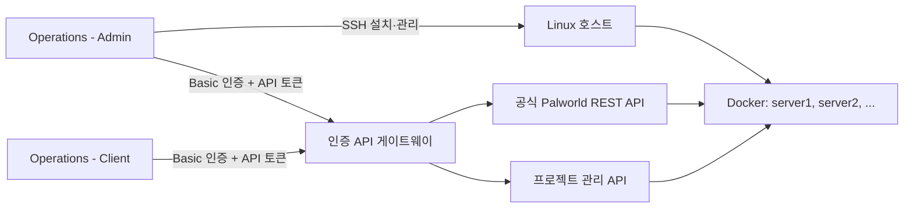

<p align="center">
  
</p>

> [!NOTE]
> 버전 1.0.0은 첫 공개 릴리스입니다. 주요 기능은 Ubuntu 22.04 호스트를
> 중심으로 테스트했지만, 하드웨어·네트워크·기존 서버 구성에 따라 예상하지
> 못한 문제가 발생할 수 있습니다. Setup, Import, Restore, Remove를 사용하기
> 전에 중요한 월드 데이터의 별도 백업을 보관하세요.

# Palworld Server Operations

[English](README.md) | 한국어

원격 Linux 호스트에 팰월드 전용 서버를 설치하고 운영하는 비공식 오픈소스
프로젝트입니다. Docker 기반 서버 런타임과 두 종류의 Windows 단일 실행 파일로
구성됩니다.

- **Palworld Server Operations - Admin**은 SSH를 사용해 서버를 설치하고
  관리합니다. Server API를 통한 일상 운영 기능도 모두 포함합니다.
- **Palworld Server Operations - Client**는 Admin으로 구성한 서버를 Server
  API로 운영하는 프로그램입니다. SSH와 설치·제거 기능은 제공하지 않습니다.

> [!IMPORTANT]
> 이 프로젝트는 Pocketpair와 제휴하거나 Pocketpair의 후원 또는 승인을 받은
> 프로젝트가 아닙니다. Palworld와 관련 명칭 및 상표의 권리는 각 권리자에게
> 있습니다. 팰월드 서버 바이너리는 이 저장소에서 배포하지 않습니다.

## 핵심 기능 소개

이 프로젝트가 특히 집중하는 부분은 다음과 같습니다.

- **설치부터 운영까지 하나의 흐름으로 연결합니다.** 작업 디렉터리 준비, 공통
  설정 검토, 호스트 검사, Docker 설치, 신규 서버 생성, 기존 월드 가져오기,
  일상 운영과 제거까지 Admin에서 이어서 진행할 수 있습니다.
- **게임 프로세스와 컨테이너를 구분해 관리합니다.** 운영 시간, 예약 재시작,
  자동 업데이트 정책은 Linux 감독기가 유지합니다. 안전 시작·재시작·종료는
  플레이어 안내와 월드 저장을 거친 뒤 원래 운영 정책으로 돌아갑니다.
- **운영 자동화를 세밀하게 설정할 수 있습니다.** 24시간 운영뿐 아니라
  `14:00-05:00`처럼 자정을 넘는 운영 시간도 지정할 수 있으며, 운영 시간에
  맞춰 자동으로 시작·종료하고 비정상 종료도 복구합니다. 여러 예약 재시작 시각,
  업데이트 확인 주기와 사전 안내 시간을 설정하면 새 버전을 감지해 플레이어
  안내와 월드 저장 후 안전하게 업데이트합니다.
- **관리자 도구와 운영자 도구를 분리합니다.** Admin은 SSH와 위험한 관리 기능을
  담당하고, Client는 준비된 서버의 Server API 기능만 제공합니다.
- **여러 서버와 기존 월드를 함께 다룹니다.** 한 프로젝트에서 `server1`,
  `server2`처럼 여러 인스턴스를 관리할 수 있고, 기존 `Pal/Saved`와 게임 설정을
  검토한 뒤 새 관리 서버로 가져올 수 있습니다.
- **상태 변경의 안전성을 우선합니다.** 관리 작업 잠금, 프로젝트 소유권 검증,
  월드 저장과 백업 검증, 실패 시 복구 절차를 사용합니다. 이미지나 컨테이너를
  다시 만들어도 영구 월드와 설정, 로그, 운영 정책은 분리해 보존합니다.
- **운영 상태를 한곳에서 확인합니다.** 호스트와 선택한 게임 컨테이너의
  CPU·메모리·네트워크 사용량, 최근 7일 동향, Status History와 런타임 로그를
  Windows UI에서 확인할 수 있습니다. SSH Management 하단의 모니터링만 선택한
  SSH 세션이 연결된 동안 동작합니다.

## 구성



## 기능 한눈에 보기

### Client

| 기능 | 할 수 있는 작업 |
|---|---|
| **서버 조회** | 서버 정보, 접속 플레이어, 게임 설정, 서버 지표 조회 |
| **플레이어 운영** | 전체 공지, 플레이어 추방·차단·차단 해제 |
| **월드 관리** | 즉시 저장, 백업 목록 확인과 월드 복원 |
| **서버 제어** | 운영 정책을 반영하는 안전 시작·재시작·종료 |
| **상태 확인** | 최근 서버 런타임 로그, 호스트와 게임 서버의 실시간 자원 사용량 및 동향 |
| **연결 보관** | 현재 Windows 계정으로 암호화한 Server API 연결 설정 저장 |

Client는 Admin 또는 Linux 설치 프로그램으로 준비한 서버에만 연결됩니다.
일반 팰월드 REST API만 실행 중인 서버에는 연결할 수 없습니다.

### Admin

Admin은 위 Client 기능을 모두 포함하며 다음 기능을 추가로 제공합니다.

| 화면 | 주요 기능 |
|---|---|
| **Server API** | Client와 같은 서버 조회·운영·복원·로그·모니터링 기능 |
| **SSH Terminal** | 연결한 Linux 호스트에서 명령을 실행하는 대화형 터미널 |
| **SSH Management** | SSH 연결 관리, 작업 디렉터리 준비, 공통 설정 검토, 호스트 검사 |
| **Setup** | 신규 서버 설치 및 시작, 기존 팰월드 서버 가져오기 |
| **Manage** | 이미지 갱신, ENV 적용, 월드 초기화·복원, API 토큰 확인·재발급 |
| **Test** | 선택한 서버 또는 전체 관리 서버의 구성과 동작 종합 검사 |
| **Remove** | 선택 서버, 모든 서버 또는 프로젝트 전체 제거 |
| **Status History** | 실행한 작업별 로그와 `INFO`, `WARN`, `FAIL` 결과 누적 확인 |

SSH 인증은 비밀번호, keyboard-interactive, OpenSSH/PEM 개인 키를 지원합니다.
Admin에서 Setup을 완료하면 해당 SSH 연결과 `serverN`에 대응하는 Server API
연결도 자동으로 생성하거나 갱신합니다.

## 빠른 시작

### Admin으로 새 서버 설치

1. 최신 [GitHub Releases](https://github.com/MinKevin/palworld-server-operations/releases)에서
   `Palworld Server Operations - Admin.exe`를 내려받아 쓰기 가능한 폴더에 둡니다.
2. 프로그램을 실행하고 연결 저장소를 보호할 마스터 비밀번호를 만듭니다.
3. **SSH Management → Add**에서 Linux 호스트, SSH 계정, 인증 정보와 `sudo`
   비밀번호를 입력합니다.
4. **Connect**를 누른 뒤 화면 안내에 따라 **작업 디렉터리 준비 → 공통 설정
   검토 → 호스트 검사**를 진행합니다.
5. **Automated Management → Setup → 신규 서버 설치 및 시작**을 실행합니다.
6. 완료 로그에서 API 사용자명, 관리자 비밀번호, API 토큰, 게임 UDP 포트와
   REST API TCP 포트를 확인합니다.
7. 공유기·NAT·클라우드 방화벽에서 게임 UDP 포트를 포워딩합니다. 외부
   Windows에서 Server API를 사용하려면 REST TCP 포트도 함께 여는 구성을
   권장하며, VPN 또는 TLS로 보호하세요. 두 포트는 Setup 완료 로그와
   **SSH Management**에서 다시 확인할 수 있습니다.

신규 설치 서버의 자동 할당 기준은 게임 UDP `39471`, REST/관리 TCP
`39472`이며, `serverN`에는 각각 `(N - 1) × 10`을 더합니다. 기존 팰월드
서버를 가져올 때는 검토한 기존 포트를 이 기준값으로 자동 변경하지 않습니다.
필요한 경우 `serverN.env`에서 직접 바꿀 수 있습니다.

### Client 연결

1. Admin의 Setup 완료 로그 또는 자동 생성된 Server API 연결에서 접속 정보를
   확인합니다.
2. `Palworld Server Operations - Client.exe`를 실행하고 **Connection
   Settings**를 엽니다.
3. Host, Port, Username, AdminPassword와 API token을 입력해 저장합니다.
4. 연결 확인이 끝나면 필요한 조회 또는 관리 명령을 선택해 실행합니다.

| 입력 항목 | 값의 위치 |
|---|---|
| Host | Windows에서 접근할 수 있는 Linux 호스트. TLS 프록시는 `https://host` 형식 |
| Port | 직접 연결은 `PAL_SETTING_RESTAPIPort`, TLS 프록시는 외부 리스너 포트 |
| Username | `config/common.env`의 `API_USERNAME` (기본값 `admin`) |
| AdminPassword | `config/serverN.env`의 `PAL_SETTING_AdminPassword` |
| API token | `config/serverN.env`의 `API_ACCESS_TOKEN` |

API 연결에는 HTTP Basic 사용자명·관리자 비밀번호와 서버별 API 토큰이 모두
필요합니다. Host/IP만 입력하면 HTTP를 사용합니다. 인터넷을 경유한다면 VPN을
사용하거나 TLS 리버스 프록시를 구성한 뒤 `https://host`로 연결하세요.

## Admin 사용 안내

### 처음 연결했을 때

**Connect**는 SSH 연결과 프로젝트 디렉터리 존재 여부를 먼저 확인합니다.
새 호스트에서는 다음 순서로 준비합니다.

1. **작업 디렉터리 준비**

   전용 프로젝트 디렉터리와 기본 파일을 준비합니다. Docker를 설치하거나 게임
   서버를 시작하지는 않습니다.
2. **공통 설정 검토**

   `config/common.env`의 시간대, 신규 서버 기준 포트, 운영·업데이트 정책과
   API 사용자명을 확인해 저장합니다.
3. **호스트 검사**

   공통 설정의 시간대를 호스트에 적용하고 SSH·`sudo`, 시간 동기화, 프로젝트
   권한과 필수 도구를 점검합니다.

기존 프로젝트는 그 프로젝트를 만든 SSH 계정으로 연결하세요. 다른 계정 소유의
디렉터리를 임의로 변경하지 않습니다.

### Setup

- **신규 서버 설치 및 시작**은 필요한 프로그램과 관리 파일을 설치하고 다음
  `serverN`을 생성해 시작합니다. 중단된 Setup의 설정이 남아 있으면 해당
  인스턴스부터 이어서 설치합니다.
- **기존 서버 가져오기**는 연결한 호스트에서 유효한 `Pal/Saved`를 찾고,
  `PalWorldSettings.ini`를 `serverN.env`로 변환해 검토한 뒤 새 관리 서버로
  복사합니다. 원본 파일은 삭제하지 않습니다.

기존 서버를 가져올 때는 검색 결과에서 월드를 선택하고, 설정 검토 화면에서
게임·REST 포트와 `BLOCKED` 또는 `REVIEW` 항목을 확인합니다. 원본 서버를
정지한 뒤 가져오기를 실행하면 `Pal/Saved` 전체를 검증하며 복사하고 Server API
연결까지 생성합니다.

### Manage

| 작업 | 사용 방법 |
|---|---|
| **Docker 이미지 갱신 및 설정 재적용** | 선택한 Docker 이미지를 갱신하고 저장된 설정으로 컨테이너를 다시 만듭니다. 현재 언어의 `server.template.env`도 백업 후 갱신하며, 새 양식은 이후 생성하는 서버부터 사용합니다. 기존 `serverN.env`는 변경하지 않습니다. |
| **서버 월드 초기화** | 복구용 보관본을 만든 뒤 새 월드를 생성합니다. 화면에 표시된 `RESET serverN`을 입력합니다. |
| **서버 월드 복원** | 백업을 선택해 복원합니다. 컨테이너와 관리 API는 실행 중이어야 하며 게임 프로세스는 이미 정지되어 있어도 됩니다. 복원 직전 월드도 별도 보존합니다. `RESTORE serverN`을 입력합니다. |
| **API token 확인** | 현재 토큰을 표시하고 연결된 Server API 항목과 동기화합니다. |
| **API token 재발급** | 토큰을 바꾸고 컨테이너를 안전하게 재시작한 뒤 API와 게임 상태를 확인합니다. |
| **[only Windows] server.env 편집·적용** | 선택한 `serverN.env`를 저장만 하거나 저장 후 즉시 적용합니다. |

`common.env`는 **공통 설정 검토**에서 변경합니다. 서버별 설정은
`server.env` 편집 화면에서 변경합니다.
이미지 갱신, ENV 적용, 토큰 재발급 중에는 Server API와 모니터링 연결이 잠시
끊길 수 있습니다.

### Test

**서버 검사**는 설정, 포트, Docker 상태, 저장소 mount, 권한, 운영 정책,
REST·관리 API와 관리 명령을 종합적으로 점검합니다.

- 서버 한 대를 선택하면 해당 서버만 검사합니다.
- **전체 서버**를 선택하면 모든 관리 서버를 차례로 검사합니다.
- 평소 상태 확인에는 Host Check, Status History, Server API와 자원 모니터링을
  사용하고, 설치 후 검증이나 문제 분석이 필요할 때 Test를 실행하면 됩니다.

### Remove

| 작업 | 제거 범위 |
|---|---|
| **선택 서버 제거** | 선택한 컨테이너, 설정, 월드, 백업, 서버 volume과 연결된 로컬 Server API 항목 |
| **모든 관리 서버 제거** | 모든 `serverN`과 해당 데이터. 프로젝트 디렉터리와 Docker는 유지 |
| **관리 디렉터리까지 전체 제거** | 모든 관리 서버와 프로젝트가 만든 경로. Docker와 공용 호스트 설정은 유지 |

삭제 작업은 화면에 표시되는 `DELETE ...` 확인 문구를 정확히 입력해야
실행됩니다.

### 평소 운영

- 일반 운영에는 직접 Shutdown/Stop보다 **Advanced Start**, **Advanced
  Restart**, **Advanced Shutdown**을 권장합니다. Advanced Start와 Restart는
  시작 전에 SteamCMD 갱신·검증을 실행하며, Restart와 Shutdown은 플레이어 안내와
  월드 저장도 처리합니다. 세 기능 모두 감독기의 운영 정책을 함께 반영합니다.
- 상태를 바꾸는 Setup·Manage·Test·Remove 또는 복원 작업은 한 번에 하나만
  실행하세요.
- Status History에서 `[WARN]`과 `[FAIL]`을 확인하세요. 로그를 공유할 때는
  비밀번호, 토큰, 공인 IP, 호스트명과 월드 정보를 가리세요.
- 월드 초기화·복원·제거 전에는 프로그램의 서버 선택, 백업 목록과 최종 확인
  문구에서 대상 `serverN`과 백업 이름을 다시 확인하세요.

## Linux 설치 프로그램

Linux 설치 프로그램의 모든 기능은 Windows Admin에서도 지원합니다. Windows
Admin 없이 Linux 터미널에서 직접 관리할 때는
[`PalworldServerInstaller.run`](PalworldServerInstaller.run)을 사용할 수
있습니다.

```bash
chmod +x PalworldServerInstaller.run
./PalworldServerInstaller.run --language ko
```

`--project-dir /path/to/palworld-docker`로 프로젝트 디렉터리를 지정할 수
있습니다. 지정하지 않으면 설치 파일 옆에 `palworld-docker` 디렉터리를
사용합니다. `.run`은 Setup, Manage, Test, Remove 메뉴를 제공하지만 안내형
기존 서버 가져오기와 Windows ENV 편집 UI는 포함하지 않습니다.

`--language`은 생성되는 ENV 템플릿 주석과 플레이어 안내 메시지의 언어를
선택합니다. 현재 대화형 Linux 메뉴는 한국어이며, 한국어·영어 Windows UI는
Admin과 Client에서 제공합니다.

## 요구 사항

Linux 호스트:

- Ubuntu 22.04 이상 또는 Debian 11 이상 x86-64/amd64
- Python 3.9 이상과 정상적으로 `sudo`를 사용할 수 있는 Linux 계정
- Docker, SteamCMD와 팰월드 서버를 내려받을 수 있는 인터넷 연결
- 최소 4 CPU 코어, 로컬 SSD/NVMe, 서버당 RAM 16GB 권장
  (여유 있는 운영에는 32GB 권장)

Windows 운영 PC:

- Windows PowerShell 5.1과 .NET Framework 4.x
- 대상 호스트의 SSH 포트와 설정한 API 포트에 접근할 수 있는 네트워크
- EXE와 암호화된 연결 저장소를 둘 수 있는 쓰기 가능한 폴더

각 Windows 프로그램은 단일 EXE로 배포됩니다. Python, 별도 PowerShell 모듈,
SSH.NET DLL을 따로 설치할 필요가 없습니다.

새 게임 파일 volume은 Setup 전에 12 GiB 이상의 여유 공간을 권장합니다.
여유 공간이 부족하면 경고 후 계속 진행하지만 SteamCMD 설치 또는 갱신은 실패할 수 있습니다.
월드, 백업, 로그와 향후 업데이트를 위한 공간은 별도로 더 확보하세요.

## 설정과 데이터

Docker 호스트 하나에는 Palworld Server Operations 프로젝트 디렉터리를 하나만
사용하세요. 프로젝트 하나에서 여러 `serverN`을 관리할 수 있습니다.

- `config/common.env`: 시간대, 기준 포트, 운영·업데이트 정책, API 사용자명처럼
  프로젝트 전체에 적용하는 설정
- `config/server.template.env`: 새 `serverN.env`를 만들 때 사용하는 템플릿
- `config/en/`, `config/kr/`: 영어·한국어 주석과 플레이어 메시지가 포함된
  같은 구성의 템플릿
- `config/serverN.env`: 서버별 포트, 비밀번호, API 토큰과 게임 설정
- `data/serverN/saved`: 영구 월드와 팰월드 Saved 데이터
- `data/serverN/logs`: 런타임 로그와 `resource-usage.sqlite3`
  (전체 경로: `data/serverN/logs/resource-usage.sqlite3`)
- `backups/serverN`: 자동 백업과 복원 전 보존본
- `runtime/policy/serverN`: 서버별 영구 운영 정책

시간 값에는 `60s`, `5m`, `1h`처럼 단위를 씁니다. `PAL_SETTING_`으로 시작하는
값은 `PalWorldSettings.ini`에 반영됩니다. 변경할 항목만 주석을 해제하는 방식을
권장합니다.

프로젝트를 제거하면 자원 사용 동향도 함께 삭제됩니다. Docker 게임 파일
volume과 월드·백업 데이터는 서로 다른 저장소이므로 디스크 여유 공간을 모두
확인하세요.

## 구현에서 신경 쓴 부분

이 절은 프로그램 사용법보다 코드 구조와 개선에 관심 있는 분을 위한
내용입니다.

### 데이터와 상태 전환

- 게임 프로세스는 컨테이너 안에서 root가 아닌 전용 사용자로 실행합니다.
- 월드, 설정, 로그, 운영 정책과 백업을 컨테이너 이미지에서 분리해 저장합니다.
- 시작·재시작·종료·업데이트·복원은 영구 운영 정책을 기준으로 상태를 전환하고,
  가능한 경우 플레이어 안내와 월드 저장을 먼저 수행합니다.
- 월드 백업과 기존 서버 가져오기는 파일 구조와 해시를 검증하며, 복원 전
  현재 월드도 별도 보관합니다.
- API 토큰 재발급은 새 토큰과 API·게임 상태를 확인한 뒤 완료합니다. 중간
  단계가 실패하면 기존 ENV와 토큰, 실행 상태로 되돌리는 복구를 시도합니다.

### 소유권과 동시 실행 보호

- 프로젝트 표식, 정규 경로 등록, Docker label과 고정된 컨테이너 ID를 확인해
  다른 프로젝트의 파일이나 Docker 자원을 잘못 변경하지 않도록 설계했습니다.
- 호스트 단위·프로젝트 단위 관리 잠금으로 Setup, Manage, Test, Remove를
  직렬화합니다.
- 같은 호스트의 여러 `serverN`이 실제 Steam BuildID 조회 결과를 짧게 공유하고,
  이 값은 GitHub가 아닌 SteamCMD `app_info_print`에서 조회합니다. SteamCMD
  업데이트는 공유 잠금으로 한 번에 하나만 실행합니다. 서버별 SteamCMD
  상태 볼륨은 컨테이너를 다시 만들어도 업데이트 메타데이터를 유지합니다.
- Steam이 기존 설치 manifest가 참조하는 과거 depot를 거부하면 manifest만 백업해
  현재 depot 기준으로 자동 복구합니다. 복구도 실패하면 온전한 기존 빌드를 다시
  시작하고 원인을 상태에 남긴 뒤 최소 30분 후 재시도합니다.
- 삭제 시에도 프로젝트가 소유한 것으로 확인된 경로와 자원만 제거하며,
  관계없는 최상위 파일은 보존합니다.

### API와 로컬 비밀 정보

- 통합 API 게이트웨이는 HTTP Basic 인증과 서버별 API 토큰을 함께 확인한 뒤
  공식 팰월드 REST API 또는 프로젝트 관리 API로 요청을 전달합니다.
- 요청 본문 크기, 동시 worker 수, 소켓 대기와 입력 시간을 제한해 느리거나
  비정상적인 요청이 관리 프로세스를 계속 점유하지 않도록 했습니다.
- Admin 연결 저장소는 PBKDF2 250,000회로 마스터 비밀번호에서 키를 만들고
  AES-256 암호화와 HMAC 무결성 검증을 사용합니다. 이 연산은 최초 잠금 해제와
  실제 저장 내용이 바뀔 때만 수행합니다.
- Client의 연결 비밀 정보는 현재 Windows 사용자 범위의 DPAPI로 보호합니다.
- SSH 호스트 키는 사용자가 확인한 fingerprint로 고정하며, 키가 바뀌면 다시
  확인하기 전까지 연결을 차단합니다.

### 자원 사용량과 오버헤드

- Linux에서 `/proc`, cgroup과 네트워크 카운터를 1초 간격으로 읽어 현재
  사용량을 계산합니다.
- 동향 데이터는 15초 간격으로 SQLite에 저장하고 7일이 지난 데이터는 시간당
  한 번 정리합니다.
- SQLite는 WAL과 `synchronous=NORMAL`을 사용하며, 그래프 요청 시에만 저장된
  동향을 집계합니다.
- Windows UI의 조회 실패에는 backoff를 적용해 연결되지 않은 서버에 불필요한
  요청을 반복하지 않습니다.

### 빌드와 회귀 검증

- Linux `.run`과 SSH payload는 소스에서 다시 생성되며 manifest hash로
  일치 여부를 확인합니다.
- Windows EXE에는 빌드 입력 fingerprint를 넣어 소스·payload·의존성과
  바이너리의 불일치를 검사할 수 있습니다.
- Python 단위 테스트, Bash·PowerShell 문법 검사, 패키징 self-check와
  결정적 payload 검증을 CI에서 실행합니다.

## 보안

- 평문 HTTP API를 인터넷에 직접 노출하지 마세요. 사설망·VPN을 사용하거나 TLS
  리버스 프록시를 구성하세요.
- REST API 포트가 외부에 필요하지 않다면 `REST_API_EXPOSE=False`로 두고
  방화벽에서도 닫으세요.
- `config/serverN.env`, `.connections`, 개인 키, API 토큰, 비밀번호, 월드와
  백업을 공개 저장소나 이슈에 첨부하지 마세요.
- Client에도 서버 관리 명령이 있으므로 신뢰할 수 있는 운영자에게만
  전달하세요. Client는 신뢰할 수 없는 사용자를 격리하는 보안 경계가 아닙니다.
- 현재 Windows EXE에는 Authenticode 서명이 없어 Windows가 **알 수 없는
  게시자** 또는 SmartScreen 경고를 표시할 수 있습니다. 공식 Releases에서
  내려받고 게시된 SHA-256 checksum을 확인하세요.

취약점 제보 방법은 [.github/SECURITY.md](.github/SECURITY.md)를 참고하세요.

## 소스 빌드와 검증

Python 3.12, Windows PowerShell 5.1, .NET Framework 컴파일러와 Git Bash 또는
Bash 환경이 필요합니다.

```powershell
$env:PYTHONDONTWRITEBYTECODE = "1"
python -B tools/build_ssh_payloads.py
python -B tools/build_linux_installer.py
& 'C:\Program Files\Git\bin\bash.exe' -n `
  install/lib.sh install/manager install/scaffold.sh install/setup.sh `
  install/test operate/pal
python -B -m unittest discover -s tests -v
powershell -NoProfile -ExecutionPolicy Bypass `
  -File tools/windows-client/build-exe.ps1
python -B tools/release_checksums.py --write
python -B tools/release_checksums.py
Remove-Item Env:PYTHONDONTWRITEBYTECODE
```

빌드 결과:

- `PalworldServerInstaller.run`
- `windows/Palworld Server Operations - Admin.exe`
- `windows/Palworld Server Operations - Client.exe`

Release에는 위 세 파일과 SHA-256 checksum, 해당 버전의 GPL 소스와 라이선스를
함께 제공하는 방식을 권장합니다.

## 기여와 연락

범위가 명확한 이슈와 pull request를 환영합니다. 기여하기 전에
[.github/CONTRIBUTING.md](.github/CONTRIBUTING.md)를 읽어 주세요.

- 버그: [GitHub Issues](https://github.com/MinKevin/palworld-server-operations/issues)
- 질문과 일반적인 이야기:
  [GitHub Discussions](https://github.com/MinKevin/palworld-server-operations/discussions)
- 프로젝트 관리자: [MinKevin](https://github.com/MinKevin)

부담 없이 연락해 주세요.

## AI 보조 개발

이 프로젝트의 상당 부분은 유지관리자가 OpenAI Codex와 대화하며 방향을 정하고,
구현과 검증을 반복하는 방식으로 개발했습니다. 설계 결정, 동작 검토, 테스트와
배포에 대한 최종 책임은 유지관리자에게 있습니다. 결과를 이해하고 직접
검토·테스트하는 방식의 AI 보조 기여도 환영합니다.

## 라이선스

Palworld Server Operations는 [GNU GPL v3.0 only](LICENSE)로 배포합니다.
수정본을 배포할 때는 GPL이 요구하는 소스 제공과 라이선스 의무를 따라야
합니다. 포함된 구성 요소는 각자의 라이선스를 유지합니다. 자세한 내용은
[`tools/windows-ssh-manager/vendor/THIRD_PARTY.txt`](tools/windows-ssh-manager/vendor/THIRD_PARTY.txt)와
[NOTICE.md](NOTICE.md)를 참고하세요.
