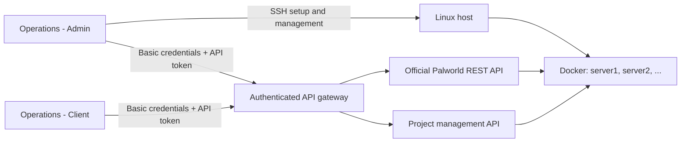

<p align="center">
  
</p>

> [!NOTE]
> Version 1.0.0 is the first public release. The main workflows have been
> tested primarily with Ubuntu 22.04 hosts, but hardware, network, and existing
> server configurations can vary. Keep an independent backup of important world
> data before using setup, import, restore, or removal operations.

# Palworld Server Operations

English | [한국어](README.ko.md)

Palworld Server Operations is an unofficial, open-source toolkit for installing
and running Palworld dedicated servers on a remote Linux host. It combines a
Docker-based server runtime with two portable Windows applications.

- **Palworld Server Operations - Admin** installs and manages servers over SSH.
  It also includes the full set of Server API tools for day-to-day operations.
- **Palworld Server Operations - Client** operates servers that were prepared
  with this project through the Server API. It does not provide SSH, setup, or
  removal features.

> [!IMPORTANT]
> This project is not affiliated with, endorsed by, or sponsored by Pocketpair.
> Palworld and related names and trademarks belong to their respective owners.
> Palworld server binaries are not distributed through this repository.

## Key features

The project focuses especially on the following:

- **One guided path from installation to daily operation.** Admin walks through
  project-directory preparation, common settings, host checks, Docker setup,
  new server creation, existing-world import, routine management, and removal.
- **The game process and its container are managed separately.** A Linux
  supervisor keeps operating hours, scheduled restarts, and automatic updates
  in effect. Safe start, restart, and shutdown actions notify players, save the
  world when needed, and return the server to its persistent operating policy.
- **Detailed operating automation.** Run a server around the clock or use a
  window that crosses midnight, such as `14:00-05:00`. The supervisor starts
  and stops the game on schedule and recovers unexpected exits. You can set
  multiple restart times, an update-check interval, and a warning period;
  detected updates are applied after a player warning and world save.
- **Separate tools for administrators and operators.** Admin owns SSH and
  high-impact maintenance. Client exposes only the Server API controls for
  servers that have already been prepared.
- **Multiple servers and existing worlds.** One project can manage `server1`,
  `server2`, and more. Admin can also inspect an existing `Pal/Saved` tree,
  review its converted game settings, and import it as a managed server.
- **Safety around state-changing work.** Management locks, project ownership
  checks, world saves, verified backups, and recovery paths reduce the chance
  of changing the wrong server or leaving an operation half-finished.
  Persistent worlds, settings, logs, policies, and backups remain separate
  from replaceable images and containers.
- **A single place to see operational health.** The Windows UI shows host and
  selected-container CPU, memory, and network usage, seven days of history,
  Status History, and recent runtime logs. The SSH Management footer polls only
  while its selected SSH session is connected.

## Architecture



## Features at a glance

### Client

| Area | What it can do |
|---|---|
| **Server information** | View server information, connected players, game settings, and metrics |
| **Player operations** | Broadcast announcements, kick players, and manage bans |
| **World management** | Save immediately, browse backups, and restore a world |
| **Server control** | Start, restart, and shut down safely while respecting the operating policy |
| **Health and logs** | View recent runtime logs plus live and historical host/server resource usage |
| **Connection storage** | Protect Server API credentials for the current Windows account |

Client connects only to a server prepared by Admin or the Linux installer. A
stock Palworld REST API by itself is not enough.

### Admin

Admin includes every Client feature and adds the following:

| Screen or group | Main features |
|---|---|
| **Server API** | The same server information, operations, restore, logs, and monitoring available in Client |
| **SSH Terminal** | An interactive terminal for the connected Linux host |
| **SSH Management** | SSH connections, project preparation, common settings, and Host Check |
| **Setup** | Install and start a new server or import an existing Palworld server |
| **Manage** | Update the image, apply ENV changes, reset or restore a world, and show or rotate the API token |
| **Test** | Run a comprehensive check against one server or every managed server |
| **Remove** | Remove one server, every managed server, or the complete project |
| **Status History** | Keep an operation-by-operation log with `INFO`, `WARN`, and `FAIL` results |

SSH authentication supports passwords, keyboard-interactive authentication,
and OpenSSH/PEM private keys. After Setup completes, Admin automatically creates
or updates the Server API connection mapped to that SSH connection and
`serverN`.

## Quick start

### Install a new server with Admin

1. Download `Palworld Server Operations - Admin.exe` from the latest
   [GitHub Release](https://github.com/MinKevin/palworld-server-operations/releases)
   and place it in a writable folder.
2. Run the application and create a master password for the portable connection
   store.
3. Open **SSH Management → Add** and enter the Linux host, SSH account,
   authentication details, and `sudo` password.
4. Select **Connect**, then follow the guided sequence:
   **Prepare Work Dir → Review Common Settings → Host Check**.
5. Run **Automated Management → Setup → Install and start a new server**.
6. When Setup finishes, note the API username, AdminPassword, API token, game
   UDP port, and REST API TCP port shown in the completion log.
7. Forward the game UDP port through the router, NAT, or cloud firewall. If you
   plan to use the Server API from an external Windows PC, we recommend
   forwarding the REST TCP port as well and protecting it with a VPN or TLS.
   Both assigned ports remain visible in the Setup log and **SSH Management**.

Automatic allocation for a newly installed server starts at game UDP `39471`
and REST/management TCP `39472`. Each `serverN` adds `(N - 1) × 10` to both
values. Importing an existing Palworld server does not silently replace the
reviewed source ports with these defaults. Ports can be changed later in
`serverN.env`.

### Connect with Client

1. Get the connection details from the Admin Setup completion log or the Server
   API connection that Admin created automatically.
2. Run `Palworld Server Operations - Client.exe` and open **Connection
   Settings**.
3. Enter the Host, Port, Username, AdminPassword, and API token, then save.
4. Once verification succeeds, choose the information or management command
   you want to run.

| Field | Where to find it |
|---|---|
| Host | Linux host reachable from Windows. For a TLS proxy, use `https://host`. |
| Port | Direct connection: `PAL_SETTING_RESTAPIPort`. TLS proxy: its external listener port. |
| Username | `API_USERNAME` in `config/common.env` (default: `admin`) |
| AdminPassword | `PAL_SETTING_AdminPassword` in `config/serverN.env` |
| API token | `API_ACCESS_TOKEN` in `config/serverN.env` |

API requests require both the HTTP Basic username/AdminPassword pair and the
per-server API token. A plain host or IP uses HTTP. When traffic crosses the
internet, use a VPN or place the API behind a TLS reverse proxy and connect with
`https://host`.

## Admin guide

### First connection

**Connect** checks the SSH session and whether the project directory exists.
On a new host, complete these steps in order:

1. **Prepare Work Dir**

   Creates the dedicated project directory and its base files. It does not
   install Docker or start a game server.

2. **Review Common Settings**

   Review `config/common.env`, including the timezone, new-server port bases,
   operating and update policy, and API username.

3. **Host Check**

   Applies the selected timezone to the host and checks SSH, `sudo`, time
   synchronization, project permissions, and required tools.

Connect to an existing project with the SSH account that owns it. Admin does
not take ownership of another account's project directory.

### Setup

- **Install and start a new server** installs the required software and
  management files, then creates and starts the next `serverN`. If an
  interrupted Setup left a config-only instance, Setup resumes that instance
  first.
- **Import an existing server** searches the connected host for a valid
  `Pal/Saved` tree, converts `PalWorldSettings.ini` into a reviewable
  `serverN.env`, and imports the selected world into a new managed server. The
  source files are not deleted.

During import, choose the source world, then review its game and REST ports plus
any `BLOCKED` or `REVIEW` settings. After the source server is stopped, Admin
copies and verifies the full `Pal/Saved` tree, runs Setup, and creates the
matching Server API connection.

### Manage

| Action | How to use it |
|---|---|
| **Update image and reapply settings** | Update the selected image and safely recreate the container from its saved configuration. |
| **Reset server world** | Create a recovery archive, then initialize a new world. Enter the displayed `RESET serverN` confirmation. |
| **Restore server world** | Choose a backup to restore. The container and its management API must be running; the game process may already be stopped. The pre-restore world is preserved as well. Enter `RESTORE serverN`. |
| **Show API token** | Display the current token and synchronize the mapped Server API connection. |
| **Rotate API token** | Replace the token, safely restart the container, and verify the API and game state. |
| **[only Windows] Edit and apply server.env** | Save the selected `serverN.env` only, or save and apply it immediately. |

Use **Review Common Settings** for `common.env`; the per-server ENV editor
changes only `serverN.env`. Server API and monitoring may disconnect briefly
while an image, ENV, or rotated token is being applied.

### Test

**Check server** runs a comprehensive diagnostic covering configuration, ports,
Docker state, storage mounts, permissions, operating policy, REST and
management APIs, and management commands.

- Select one server to test only that server.
- Select **All servers** to test every managed server in sequence.
- For routine checks, use Host Check, Status History, Server API, and resource
  monitoring. Run Test after installation, after a significant change, or
  while investigating a problem.

### Remove

| Action | What it removes |
|---|---|
| **Remove selected server** | The selected container, configuration, world, backups, server volume, and mapped local Server API connection |
| **Remove all managed servers** | Every `serverN` and its data, while keeping the project directory and Docker |
| **Remove all servers and the project directory** | Every managed server and project-owned path, while keeping Docker and shared host configuration |

Removal requires the exact `DELETE ...` confirmation shown by Admin.

### Routine operation

- Prefer **Advanced Start**, **Advanced Restart**, and **Advanced Shutdown** to
  the direct Shutdown/Stop calls. They handle the required player warning and
  world save, then keep the supervisor's operating policy in sync.
- Run only one state-changing Setup, Manage, Test, Remove, or restore operation
  at a time.
- Review `[WARN]` and `[FAIL]` entries in Status History. Remove passwords,
  tokens, public addresses, hostnames, and world information before sharing
  logs.
- Before reset, restore, or removal, use the server selector, backup list, and
  final confirmation shown in the application to verify the target `serverN`
  and backup name.

## Linux installer

Every feature in the Linux installer is also available through Windows Admin.
Use [`PalworldServerInstaller.run`](PalworldServerInstaller.run) when you want
to manage the project directly from a Linux terminal without Admin.

```bash
chmod +x PalworldServerInstaller.run
./PalworldServerInstaller.run --language en
```

Use `--project-dir /path/to/palworld-docker` to choose the project directory.
Without it, the installer uses a `palworld-docker` directory beside the `.run`
file. The terminal menu includes Setup, Manage, Test, and Remove. Guided
existing-server import and the Windows ENV editor are not part of the terminal
UI.

`--language` selects the language used for generated ENV comments and default
player-facing messages. The interactive Linux menu is currently Korean; the
Windows Admin and Client interfaces are available in both English and Korean.

## Requirements

Linux host:

- Ubuntu 22.04+ or Debian 11+ on x86-64/amd64
- Python 3.9+ and a Linux account with working `sudo`
- Internet access for Docker, SteamCMD, and Palworld server downloads
- At least 4 CPU cores, local SSD/NVMe storage, and 16 GB RAM per server
  (32 GB is recommended for more comfortable operation)

Windows operator PC:

- Windows PowerShell 5.1 and .NET Framework 4.x
- Network access to the host's SSH port and configured API port
- A writable folder for the EXE and encrypted connection store

Each Windows application is distributed as a single EXE. You do not need to
install Python, a separate PowerShell module, or SSH.NET on the operator PC.

A new game-file volume needs at least 12 GiB of free space before Setup. Keep
additional space available for worlds, backups, logs, and future updates.

## Configuration and data

Use one Palworld Server Operations project directory per Docker host. A single
project can manage multiple `serverN` instances.

- `config/common.env`: project-wide timezone, base ports, operating and update
  policy, and API username
- `config/server.template.env`: template for new `serverN.env` files
- `config/en/` and `config/kr/`: matching templates with English or Korean
  comments and player-facing messages
- `config/serverN.env`: server-specific ports, passwords, API token, and game
  settings
- `data/serverN/saved`: persistent world and Palworld Saved data
- `data/serverN/logs`: runtime logs and `resource-usage.sqlite3`
  (full path: `data/serverN/logs/resource-usage.sqlite3`)
- `backups/serverN`: automatic backups and pre-restore archives
- `runtime/policy/serverN`: persistent operating policy for each server

Duration settings use explicit units such as `60s`, `5m`, and `1h`. Values
starting with `PAL_SETTING_` are written to `PalWorldSettings.ini`. Uncomment
only the settings you intend to override.

Removing the project also removes its resource-usage history. Docker game-file
volumes and world/backup data use different storage locations, so make sure both
filesystems have enough free space.

## Engineering notes

This section is for readers who are interested in the implementation rather
than only the user workflow.

### Data and state transitions

- The game process runs as a dedicated non-root user inside the container.
- Worlds, settings, logs, operating policy, and backups are stored separately
  from the container image.
- Start, restart, shutdown, update, and restore actions follow the persistent
  operating policy and perform player warnings and world saves where applicable.
- World backups and existing-server imports validate both file structure and
  hashes. Restore also preserves the world that it replaces.
- Token rotation verifies the new token, API, and game state before reporting
  success. If an intermediate step fails, it attempts to restore the previous
  ENV, token, and running state.

### Ownership and concurrency

- Project markers, canonical-path registration, Docker labels, and immutable
  container IDs are checked before state-changing work, reducing the risk of
  modifying resources owned by another project.
- Host-wide and project-wide management locks serialize Setup, Manage, Test,
  and Remove.
- A shared update lock keeps multiple `serverN` instances on one host from
  running SteamCMD updates at the same time.
- Removal deletes only paths and resources that can be verified as
  project-owned. Unrelated top-level files are preserved.

### API and local secrets

- The integrated API gateway requires both HTTP Basic authentication and the
  per-server API token before forwarding a request to the official Palworld
  REST API or the project management API.
- Request body sizes, concurrent workers, socket waits, and input deadlines are
  bounded so slow or malformed clients cannot occupy the management process
  indefinitely.
- Admin derives encryption keys from the master password with PBKDF2 at 250,000
  iterations, then uses AES-256 encryption and HMAC integrity protection. The
  expensive derivation runs only when the store is first unlocked or its saved
  content actually changes.
- Client protects connection secrets with Windows DPAPI for the current Windows
  account.
- SSH host keys are pinned to a fingerprint accepted by the user. A changed key
  blocks the connection until it is reviewed again.

### Resource monitoring and overhead

- Linux samples `/proc`, cgroup, and network counters once per second to
  calculate current usage.
- History is written to SQLite every 15 seconds and retained for seven days.
  Expired rows are cleaned up once per hour.
- SQLite uses WAL mode with `synchronous=NORMAL`, and stored history is
  aggregated only when a graph is requested.
- The Windows UI backs off after failed polls instead of repeatedly querying an
  unavailable server.

### Builds and regression checks

- The Linux `.run` file and SSH payloads are regenerated from source and
  verified against manifest hashes.
- Windows EXEs include a build-input fingerprint so the application source,
  payloads, dependencies, and committed binary can be checked for consistency.
- CI runs Python unit tests, Bash and PowerShell syntax checks, packaged
  self-checks, and deterministic payload verification.

## Security

- Do not expose a plaintext HTTP API directly to the public internet. Use a
  private network or VPN, or configure a TLS reverse proxy.
- If external API access is unnecessary, keep `REST_API_EXPOSE=False` and close
  the port in the firewall.
- Never commit or attach `config/serverN.env`, `.connections`, private keys,
  API tokens, passwords, world data, or backups to a public issue or repository.
- Client can issue administrative commands. Give it only to trusted operators;
  it is not a security boundary for untrusted users.
- The current Windows EXEs are not Authenticode-signed, so Windows may show an
  **Unknown Publisher** or SmartScreen warning. Download releases from the
  official repository and verify the published SHA-256 checksum.

See [.github/SECURITY.md](.github/SECURITY.md) for vulnerability reporting.

## Build and verification

Building requires Python 3.12, Windows PowerShell 5.1, a .NET Framework
compiler, and Git Bash or another Bash environment for shell syntax checks.

```powershell
$env:PYTHONDONTWRITEBYTECODE = "1"
python -B tools/build_ssh_payloads.py
python -B tools/build_linux_installer.py
& 'C:\Program Files\Git\bin\bash.exe' -n `
  install/lib.sh install/manager install/scaffold.sh install/setup.sh `
  install/test operate/pal
python -B -m unittest discover -s tests -v
powershell -NoProfile -ExecutionPolicy Bypass `
  -File tools/windows-client/build-exe.ps1
python -B tools/release_checksums.py --write
python -B tools/release_checksums.py
Remove-Item Env:PYTHONDONTWRITEBYTECODE
```

Build outputs:

- `PalworldServerInstaller.run`
- `windows/Palworld Server Operations - Admin.exe`
- `windows/Palworld Server Operations - Client.exe`

Releases should include those three files, their SHA-256 checksums, and the
matching GPL source and license.

## Contributing and contact

Focused issues and pull requests are welcome. Please read
[.github/CONTRIBUTING.md](.github/CONTRIBUTING.md) before contributing.

- Bugs: [GitHub Issues](https://github.com/MinKevin/palworld-server-operations/issues)
- Questions and general discussion:
  [GitHub Discussions](https://github.com/MinKevin/palworld-server-operations/discussions)
- Maintainer: [MinKevin](https://github.com/MinKevin)

Feel free to get in touch.

## AI-assisted development

Much of this project was developed through maintainer-directed conversations
with OpenAI Codex, followed by repeated implementation and verification. The
maintainer remains responsible for design decisions, behavior, testing, and
releases. AI-assisted contributions are welcome when the contributor
understands, reviews, and tests the result.

## License

Palworld Server Operations is licensed under
[GNU GPL v3.0 only](LICENSE). Distributed modified versions must follow the
GPL's source and license obligations. Bundled third-party components retain
their own licenses; see
[`tools/windows-ssh-manager/vendor/THIRD_PARTY.txt`](tools/windows-ssh-manager/vendor/THIRD_PARTY.txt)
and [NOTICE.md](NOTICE.md).
